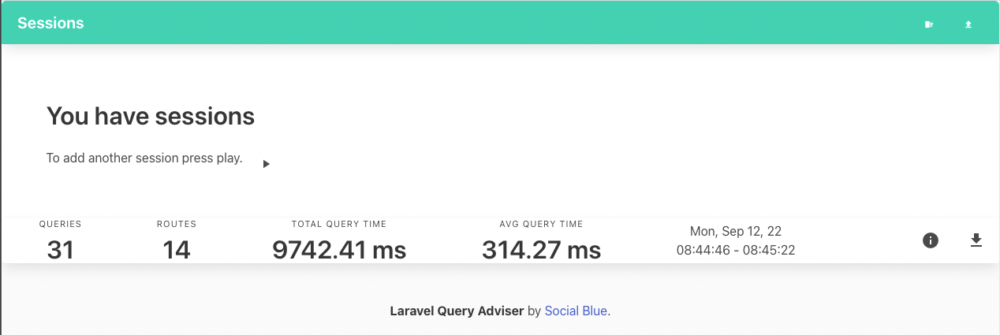
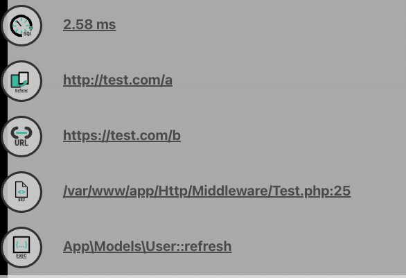

# Laravel-Query-Adviser

[](https://packagist.org/packages/socialblue/laravel-query-adviser)
[](https://scrutinizer-ci.com/g/socialblue/laravel-query-adviser)
[](https://packagist.org/packages/socialblue/laravel-query-adviser)


<table>
    <tr>
        <td></td>
        <td>With Laravel Query Adviser you can get more insights into the SQL queries created by Eloquent models used in your app.
It logs the queries used by your application and provides a helpful overview of the SQL queries. You can rerun the SQL query to analyze the database impact or copy the SQL query to your clipboard.
The handy card view allows you to quickly point out the pain points of your application's SQL queries.</td>
    </tr>
</table>


## Installation

You can install the package via composer:

```bash
composer require socialblue/laravel-query-adviser --dev
```

Publish Laravel-Query-Adviser 

```bash
php artisan vendor:publish --provider="Socialblue\LaravelQueryAdviser\LaravelQueryAdviserServiceProvider"
```

**Publish the front-end application after updating**

```bash
php artisan vendor:publish --tag=public --force
```


**When updating from `0.13.2` to `0.14.0` please use**

```bash
php artisan vendor:publish --provider="Socialblue\LaravelQueryAdviser\LaravelQueryAdviserServiceProvider" --force
```

## Usage

### Output queries inline
> Dump and die
> ``` php
> User::join('posts', 'posts.users_id', '=', 'users.id')
> ->select([DB::raw('SUM(posts.id)')])
> ->where('users.id', 1)
> ->select([DB::raw('SUM(post.id)')])->qadd();
> ```
> or just dump
> ``` php
> 
> User::join('posts', 'posts.users_id', '=', 'users.id')
> ->select([DB::raw('SUM(posts.id)')])
> ->where('users.id', 1)
> ->select([DB::raw('SUM(post.id)')])->qadump();
>
> ```
> both dump this array
>
> ```php
> [
>    'toSql' => 'select sum(posts.id) from users join posts on posts.users_id = users.id where users.id = ?'
>    'bindings' => [1]
>    'query' => 'select sum(posts.id) from users join posts on posts.users_id = users.id where users.id = 1'
> ]
> ```

### Start query logging session

1. To start a query log session goto {app_url}/query-adviser/
2. Press play and open the pages of your app you want to log the queries of
3. Stop the session and click on the session bar to see all the details.

> #### Session stepper
> 

> #### Session list
> 

### Brows through session overview

> #### Query time-line
> *collapse and expand the panels for less or more information about the queries executed in that time frame.*
> 

#### Groups
You can group the queries by time, routes and rawQuery.
Also you can clear the cached queries by pressing the eject button.
> *group by time, routes, referer, raw queries, queries with bindings, and query time*


#### Sort
> *Sort the time line by last inserted, slowest query, and most occurrences*


#### Query card
> *Re-execute a query, get query information, and copy the query to your clipboard*


#### Query labels
As of version 0.10.0, the query card has labels related to the class,
file and function of the query executed from your app folder.

> *File Information*
> 

Open the explain dialog to see more information about the query.

> *Query information*
> 

> *Re-execute Query*
> 

### Testing

``` bash
composer test
```

## Contributing

Please see [CONTRIBUTING](CONTRIBUTING.md) for details.

### Security

If you discover any security related issues, please email mark.broersen@outlook.com instead of using the issue tracker.

## Credits

- [Mark](https://github.com/socialblue)
- [All Contributors](../../contributors)

## License

The MIT License (MIT). Please see [License File](LICENSE.md) for more information.

## Laravel Package Boilerplate

This package was generated using the [Laravel Package Boilerplate](https://laravelpackageboilerplate.com).


svg
use rect for table
use polyline for joins
use groups for sub queries


table names 
show relations
snap to grid (24,24)
collision detection Add minimal space between tables using aabb
