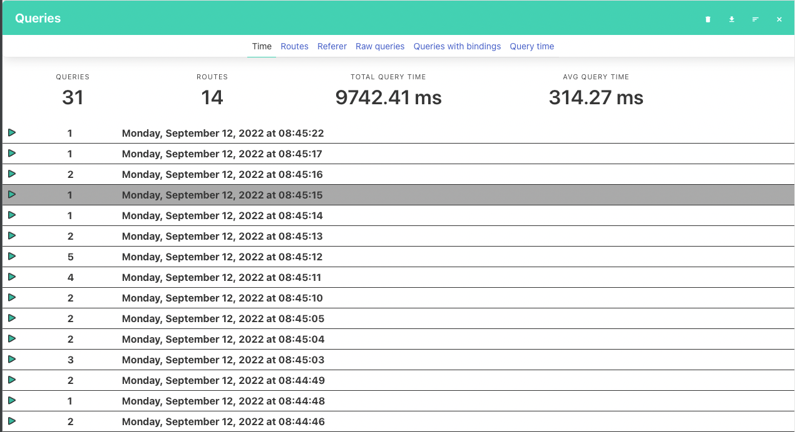
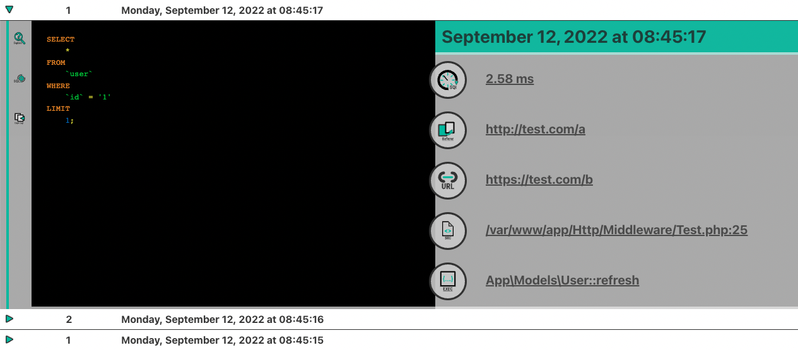

# Laravel-Query-Adviser

[](https://packagist.org/packages/socialblue/laravel-query-adviser)
[](https://travis-ci.org/socialblue/laravel-query-adviser)
[](https://scrutinizer-ci.com/g/socialblue/laravel-query-adviser)
[](https://packagist.org/packages/socialblue/laravel-query-adviser)

This package can help you in optimizing your MySql queries created by your Eloquent models.
It logs the queries used by your application and provides a helpful overview of the queries.
You can rerun the query analyze the database impact or just copy the query to your clipboard.

The handy card view allows you to quickly see the pain points of your application.

goto **{app_url}/query-adviser/query**
> 




collapse and expand the panels for less or more information about the queries executed in that time frame.

**Groups**

You can group the queries by time, routes and rawQuery.
Also you can clear the cached queries by pressing the eject button.


**Query card**

> | execute | information | copy to clipboard |

Open the explain dialog to see more information about the query.

**Query information**


**Re-execute Query**


## Installation

You can install the package via composer:

```bash
composer require socialblue/laravel-query-adviser

php artisan vendor:publish
```

## Usage

``` php

$userBuilder = User::getQuery()
->join('post', 'post.user_id', '=', 'user.id')
->select([DB::raw('SUM(post.id)')]);
dd(QueryBuilderHelper::info($userBuilder));


```

### Testing

``` bash
composer test
```

### Changelog

Please see [CHANGELOG](CHANGELOG.md) for more information what has changed recently.

## Contributing

Please see [CONTRIBUTING](CONTRIBUTING.md) for details.

### Security

If you discover any security related issues, please email mark.broersen@outlook.com instead of using the issue tracker.

## Credits

- [Mark](https://github.com/socialblue)
- [All Contributors](../../contributors)

## License

The MIT License (MIT). Please see [License File](LICENSE.md) for more information.

## Laravel Package Boilerplate

This package was generated using the [Laravel Package Boilerplate](https://laravelpackageboilerplate.com).